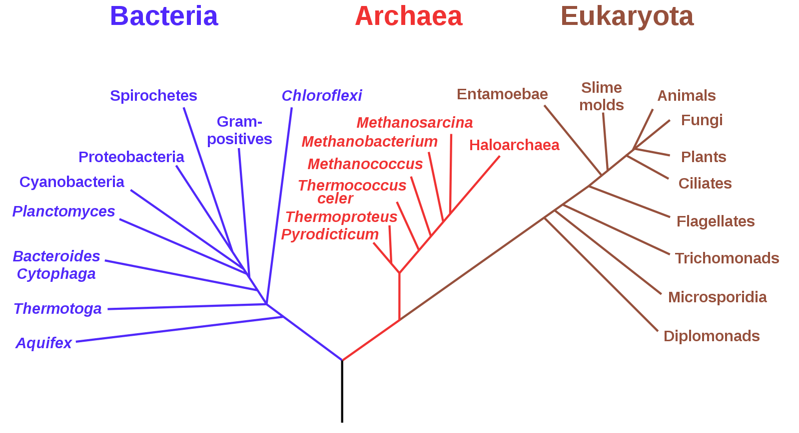
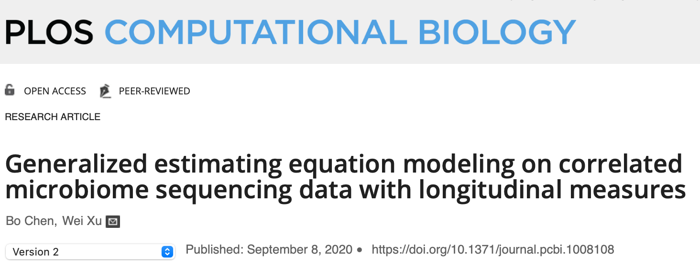
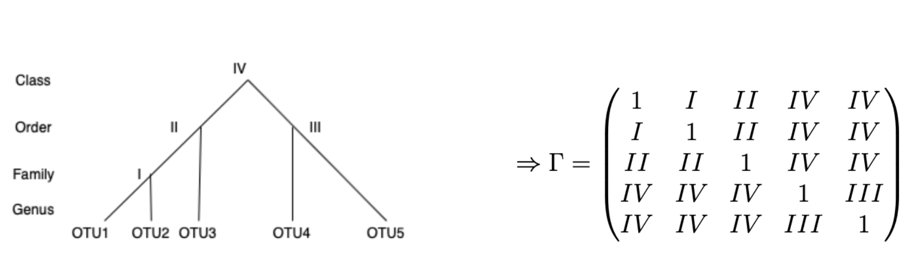
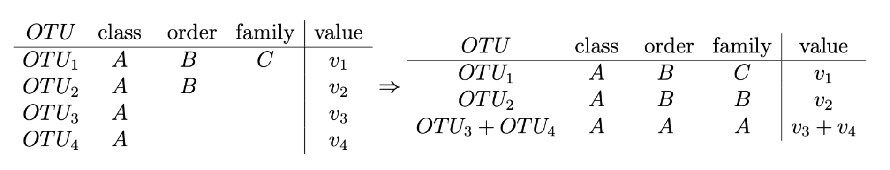
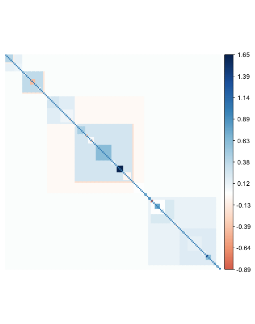
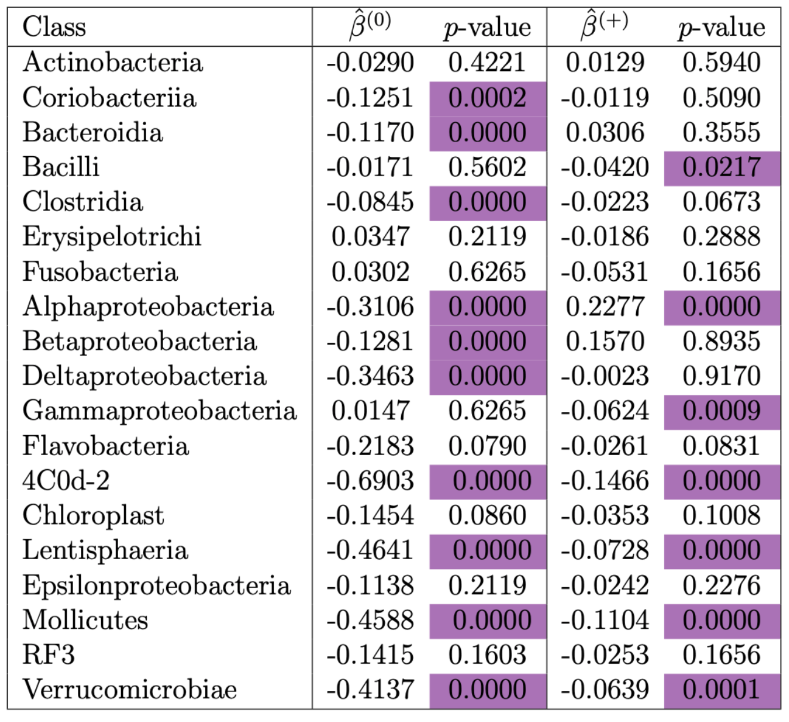

```{r setup, include=FALSE}
knitr::opts_chunk$set(echo = FALSE)
```

## Overview 

- Introduction to microbiome data and Generalized Estimating Equations
- The Microbiome Taxonomic Longitudinal Correlation (MTLC) model 
- Application to the American Gut Project 


## The microbiome & microbiome data 

- We (humans) have millions of microbes. The microbiome is the collection of these.
- Studies associated the human gut microbiome to inflammatory bowel disease, cancers, diabetes, and obesity, interactions between the gut and the central nervous system
- Counts of reads for operational taxonomic units (OTUs) 
- Aspects of Microbiome data: 
    - \# OTUs > \# samples 
    - Sparse (many OTUs are zero)
    - Sampling depth - define


## Taxonomic Hierarchy 

- OTUs can be organized into a Taxonomic tree 
- Taxonomic information label for Kingdom, Phylum, Class, Order, Family Genus, Species 
- Tree can be coarse (not all species are identified/labeled )

<figure>
  
  <figcaption>Source: Wikipedia .</figcaption>
</figure>

## Clusters

- Individual $k$ sampled at different discrete time points, and has measurements for different OTUs. 
- Cluster $\mathbf{y}_k = (y_{k,1}, \ldots , y_{k,n_j})$ all OTU measurements at all time observations
- Within this cluster, these points are dependent
    - Correlations from time 
    - 'similar' OTUs can be correlated 
- Need to find a model that doesn't require independence

## Generalized estimating equations (GEEs)
- Generalization of generalized linear models for dependent data. Do not need specified joint distribution
- Working correlation matrix that describes unique correlations to model dependency in the data
- Link mean response to regression equation: 
$$g(\mu_{kj}) = \mathbf{x}_{kj}^T\boldsymbol \beta$$


- $\hat{\boldsymbol\beta}$ is the solution to the 
$$\sum_{k=1}^K \frac{\partial  \boldsymbol\mu_k^T }{\partial \boldsymbol\beta } \mathbf{V}_{k}^{-1} (\mathbf{y}_k - \boldsymbol{\mu}_k) = 0. $$
$\mathbf{V}_k = \phi \mathbf{A}_k^{1/2} \mathbf{R}_{k}(\boldsymbol\alpha)\mathbf{A}_k^{1/2}$ as the working covariance matrix of $\mathbf{y}_k$, where $\mathbf{A}_k$ is the diagonal matrix consisting of the values of $a_{kj}$, the variance of the response. 


## GEEs continued
- Consistent estimates even if working correlation matrix is misspecified 
- Better efficiency when the working correlation matrix is close to true correlation structure 
- Estimate population average effects 
- Iterative algorithm that switches between 
- Estimated correlations using Huber White sandwich estimator 
- hat beta normally distributed, with mean and variance so we can get wald test statistics and p-values 


## Microbiome Taxonomic Longitudinal Correlation Model 



- Two-part GEE model for assoication studies of presence/absence and (log transformed) relative abundance of present OTUs 
- Working correlation matrix from combination of longitudinal and taxonomic correlations 


## Longitudinal/ repeated measure correlation

- Repeated measures in time this is a source of correlation between OTU counts. 
- Many common correlation structures. 

$$
\begin{pmatrix}
1 & i & i \\
i & 1 & i \\
i & i & 1
\end{pmatrix}
 \text{ or } 
 \begin{pmatrix}
1 & i & ii \\
i & 1 & i \\
ii & i & 1
\end{pmatrix}\text{ or } \begin{pmatrix}
1 & 0 & 0 \\
0 & 1 & 0 \\
0 & 0 & 1
\end{pmatrix}\text{ or } \begin{pmatrix}
1 & i & ii \\
i & 1 & iii \\
ii & iii & 1
\end{pmatrix}$$ 

- If we have other repeated measures, working correlation matrix will be all distinct combinations 

$$ 
\begin{pmatrix}
1 & i & i & ii & iii & iii\\
i & 1 & i & iii & ii & iii \\
i & i & 1 & iii & iii & ii \\
ii & iii & iii & 1 & i & i \\
iii & ii & iii & i & 1 & i \\
iii & iii & ii & i & i & 1
\end{pmatrix}
$$ 

## Taxonomic correlation 


- Use the taxonomic hierarchy to build taxonomic working correlation structure
- OTUs will have the same correlation based on the first shared taxon
    - $I$: same family, different genus
    - $II$ and $III$  same orders, different families
    - $IV$ different orders but the same class




- Can represent this as a list keeping track of the number of OTUs in each group in each level 
`list(5, c(3,2), c(2,1,1,1), c(1,1,1,1,1))`


## Integrative correlation matrix 

- Combine the longitudinal repeated measure correlation and taxonomic correlation
- Each combination of distinct longitudinal correlations with distinct taxonomic correlations
- Overall Integrative Working correlation matrix 
- Example: 2 time points, with taxonomy previously described

$$R = \begin{pmatrix}
        1 & 2 & 3 & 5 & 5 &  6 & 7 & 8 & 10 & 10 \\
        2 & 1 & 3 & 5 & 5 & 7 & 6 & 8 & 10 & 10 \\
        3 & 3 & 1 & 5 & 5 & 8 & 8 & 6 & 10 & 10 \\
        5 & 5 & 5 & 1 & 4 & 10 & 10 & 10 & 6 & 9 \\
        5 & 5 & 5 & 4 & 1 & 10 & 10 & 10  & 9 & 6 \\
        6 & 7 & 8 & 10 & 10 & 1 & 2 & 3 & 5 & 5  \\
        7 & 6 & 8 & 10 & 10 & 2 & 1 & 3 & 5 & 5  \\
        8 & 8 & 6 & 10 & 10 & 3 & 3 & 1 & 5 & 5 \\
        10 & 10 & 10 & 6 & 9 & 5 & 5 & 5 & 1 & 4  \\
        10 & 10 & 10  & 9 & 6  & 5 & 5 & 5 & 4 & 1
  \end{pmatrix}$$


## Two part GEE model 

 - Model presence/absence and relative abundance separately, in two models
 - $y_{kj}^{(0)}$ is the presence/absence of the OTU (0 or 1)
 - $y_{kj}^{(+)}$ is log transformed relative abundance of OTUs that have $y_{kj}^{(0)} = 1$ 
 
$$P(y_{kj}^{(0)}=1)  = \mu_{kj}^{(0)} \qquad  y_{kj}^{(+)}\sim N(\mu_{kj}^{(+)}, \sigma^2)$$
 
 - GEE model and link functions: 
 
 
 
 $$ \log \frac{\mu_{kj}^{(0)}}{1 - \mu_{kj}^{(0)}} = \mathbf{x}_{kj}'\boldsymbol \beta^{(0)}$$
 $$\mu_{kj}^{(+)} = \mathbf{x}_{kj}'\boldsymbol \beta^{(+)} $$ 
 - Working correlation matrix as specified earlier (longitudinal + taxonomic correlations)
 


## Application 

 - How to implement this model (in R)?
 - Paper includes code for simulation study and creating integrative working correlation matrix based on a list of dimensions 
 - What happens when we try to use real data?


## American Gut Project 

 - Citizen-science project of self-selected individuals mailing in samples 
 - Includes microbiome OTU information and survey including lifestyle and health factors 
 - Filtering: 
    - Sampling depth > 500
    - Kingdom Bacteria 
    - Fecal samples
    - Genus sparsity > 10%
    - Genus level 
 - Not longitudinal - working correlation matrix will just be taxonomic 
 - Focus on antibiotic use 
    


## Recreating taxonomic structure 
 - Usually have taxonomic labels, not a tree 
 - Start at highest level, count the number of OTUs, and repeat for each sub level
 - This list represents the tree structure 
 
 
- Include dataframe for associated tree, then list, and tree 

## Unlabeled taxa values 

- Many OTUs have incomplete taxonomic labels 
- How to create taxonomic correlations when part of the tree is missing 
- Drop all missing OTUs? (Lose a lot of data)
- Treat all missing as distinct? (Correlation matrix too large)
- Fill in labels based on existing higher levels. 
- Combine OTUs that are not distinct at the lowest level. 




## GEE in R 
 - `geepack` package 
 - `geeglm(formula, family, corstr = "userdefined", zcor = ,...)`
 - Working correlation matrix vs `zcor` 
 - Upper diagonal correlation parameters $\mathbf{r}_k = (r_{k, 1,2}, r_{k,1,3}, \ldots , r_{k,1,n_k}, r_{k,2,3}, \ldots , r_{k,n_{k-1},n_k})$ 
 - `zcor` $\textbf{Z}_k$ matrix:  $\textbf{r}_k = \textbf{Z}_k \boldsymbol\alpha$
 - Has dimension $\sum_{k=1}^K \binom{n_k}{2} \times a$
 
## Adjusting for missing data 

- Incomplete clusters 
    - No observations for a given time point
    - Relative abundance missing when the OTU is absent
- Need to adjust the working correlation matrix (and `zcor`)
- For each cluster, identify the time or OTU observation that is missing
- Replace corresponding entries in the working correlation matrix with dummy values 
- Recreate `zcor`then remove rows containing the dummy value
- Repeat for each cluster 


## Computational limitations 
 - `zcor` matrix gets large quickly 
 - Maximum number of entries in a matrix is $2^{31}-1$
 - Cannot initialize on all samples in the American Gut Project 


## Model on 100 samples randomly selected 
 - Randomly select 100 samples - 165 OTUs 
 - Antibiotic usage. 1 if individual has used antibiotics in the past year 0 otherwise 
 - Relative abundance model took 6 hours to run 
 - No association between antibiotic use and relative abundance $\beta^{(+)} = 0.068, p = 0.35$
 - Presence absence model would not run after 2 days
 
 
## Estimated correlations 



## Looping through classes 

 - Instead of using the entire taxonomic tree, focus on individual classes 
 - 19 total classes included 
 - Build 
 - Takes less than 1 hour for both models on all classes 
 - Multiple comparisons adjustment using Benjamini and Hochberg to control FDR
 
## Results
 

 
## Conclusions
- Difficult to scale up the model, both in computation time and interpretation
- What taxonomic level to loop through? 

# Thank you! 


